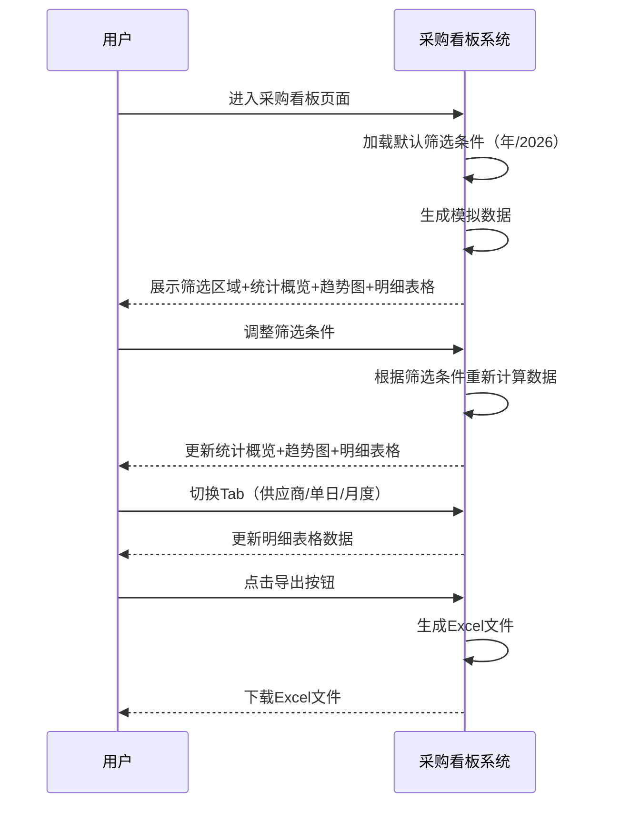

# 采购看板产品需求文档（PRD）

## 1. 文档信息

### 版本历史

| 版本号  | 更新日期       | 更新人  | 更新内容            | 审核人 |
| :--- | :--------- | :--- | :-------------- | :-- |
| V1.0 | 2026-07-13 | 产品团队 | 初始版本，完成全部功能需求编写 | -   |
| V1.1 | 2026-07-21 | 产品团队 | 新增下单款数、平均交期天数指标 | -   |

### 相关文档

- 高保真原型链接：\[待补充]

### 文档说明

**编写目的**：本文档旨在明确采购看板功能的完整需求，为研发、测试、设计团队提供开发蓝图和验收依据。

**主要读者**：前端开发工程师、测试工程师、UI设计师、产品经理
**阅读建议**：建议按章节顺序阅读，重点关注功能需求详情和业务规则部分。

***

## 目录

- [1. 文档信息](#1-文档信息)
- [2. 产品概述](#2-产品概述)
- [3. 用户与场景分析](#3-用户与场景分析)
- [4. 功能需求详情](#4-功能需求详情)
  - [4.1 功能全景图](#41-功能全景图)
  - [4.2 详细功能描述](#42-详细功能描述)
    - [4.2.1 筛选区域](#421-筛选区域)
    - [4.2.2 统计概览](#422-统计概览)
    - [4.2.3 指标趋势图](#423-指标趋势图)
    - [4.2.4 明细表格](#424-明细表格)
  - [4.3 业务流程](#43-业务流程)
- [5. 非功能需求](#5-非功能需求)
- [6. 数据需求与成功指标](#6-数据需求与成功指标)
- [7. 需求验收标准](#7-需求验收标准)
- [8. 附则](#8-附则)

***

## 2. 产品概述

### 2.1 业务痛点

当前服装供应链管理中存在以下问题：

- **交付监控不及时**：缺乏实时监控供应商交付情况的工具，无法及时发现延迟交付问题
- **数据统计效率低**：人工统计采购订单的准交率、入库件数等核心指标，耗时且容易出错
- **趋势分析缺失**：无法直观查看采购交付数据的变化趋势，难以进行预测和优化
- **多维度数据割裂**：不同维度（供应商、单日、月度）的明细数据分散，无法统一查看和分析

### 2.2 功能概述

采购看板是一款面向服装供应链管理人员的数据分析工具，通过实时展示采购订单的交付情况，帮助用户快速掌握供应商准交率、入库进度等核心指标。产品支持多时间维度（日/周/月/年）和多合作分类的筛选，提供统计概览、趋势分析和明细查询功能，助力供应链管理效率提升。

***

## 3. 用户与场景分析

### 3.1 用户画像

| 用户角色  | 岗位描述                       | 使用频率  |
| :---- | :------------------------- | :---- |
| 供应链经理 | 负责整体供应链规划和供应商管理，需要宏观把控交付情况 | 每日    |
| 采购专员  | 负责具体采购订单的跟进和执行，需要实时监控订单状态  | 每日    |
| 运营主管  | 关注采购交付对业务运营的影响，需要定期查看报表    | 每周/每月 |

### 3.2 核心诉求与工作场景

**核心诉求**：

1. 实时掌握供应商交付情况，及时发现异常
2. 快速统计准交率等关键指标，支持决策分析
3. 直观查看数据趋势，预测供应链风险
4. 灵活筛选和导出数据，满足多维度分析需求

**工作场景**：

| 场景名称  | 场景描述              | 操作流程                                |
| :---- | :---------------- | :---------------------------------- |
| 日常监控  | 供应链经理每日上班查看当日交付概况 | 打开看板 → 查看统计概览 → 查看趋势图 → 查看明细        |
| 供应商评估 | 采购专员评估供应商季度交付表现   | 选择季度时间范围 → 筛选供应商 → 查看明细表格 → 导出Excel |
| 月度总结  | 运营主管准备月度采购分析报告    | 选择月度时间范围 → 查看趋势图 → 切换至月度明细 → 导出数据   |

***

## 4. 功能需求详情

### 4.1 功能全景图

```
采购看板
├── 筛选区域
│   ├── 时间维度选择（日/周/月/年）
│   ├── 日期输入（动态变化）
│   ├── 合作分类多选
│   ├── 供应商搜索选择
│   └── 数据更新时间显示
├── 统计概览（4个卡片）
│   ├── 采购下单次数
│   ├── 应交采购单数
│   ├── 准交采购单数
│   └── 准交率
├── 指标趋势图（ECharts折线图）
│   ├── 采购下单次数趋势
│   ├── 应交采购单数趋势
│   ├── 准交采购单数趋势
│   └── 准交率趋势（虚线带面积）
└── 明细表格（Tab切换）
    ├── 供应商明细
    ├── 单日明细
    ├── 月度明细
    ├── 分页功能
    └── 导出功能
```

### 4.2 详细功能描述

#### 4.2.1 筛选区域

**功能名称**：筛选区域

**功能描述**：提供多维度筛选条件，支持用户按时间、合作分类、供应商维度过滤数据，显示当前数据更新时间。

**原型/示意图**：\[顶部筛选栏布局，从左到右依次排列各筛选组件]

**前置条件**：用户已进入采购看板页面

**后置条件**：筛选条件生效，下方统计概览、趋势图、明细表格数据实时更新

**操作流程**：

1. 选择时间维度（日/周/月/年）
2. 根据时间维度输入对应日期范围
3. 选择合作分类（支持多选/全选）
4. 选择供应商（支持搜索过滤）
5. 系统自动刷新数据

**交互及UI说明**：

| 组件     | 类名                         | 状态        | 交互反馈                                 |
| :----- | :------------------------- | :-------- | :----------------------------------- |
| 时间维度单选 | linkd-base-radio-group     | 默认选中"年"   | 点击切换，日期输入框联动变化                       |
| 日期输入框  | linkd-base-date-picker     | 根据维度动态显示  | 日-日期范围选择器；周-周选择器；月-月份区间选择器；年-年份数字输入框 |
| 合作分类多选 | linkd-base-select-multiple | 支持全选/取消全选 | 下拉展开选项列表，点击选中/取消，显示已选数量标签            |
| 供应商选择  | linkd-base-select          | 单选模式      | 输入关键词实时过滤，点击外部自动关闭下拉                 |
| 数据更新时间 | linkd-base-text            | 灰色小字      | 显示格式："YYYY-MM-DD HH:MM:SS"           |

**业务规则**：

- 默认时间维度为"年"，年份选择默认选择当前年
- 日期输入框根据时间维度动态切换显示类型，且默认值规则如下：
  - 选择"日"时，日期范围默认选择近30天
  - 选择"周"时，默认选择上一周
  - 选择"月"时，默认选择近6个月（从当前月向前推5个月）
  - 选择"年"时，默认选择当前年
- 合作分类支持全选和取消全选
- 供应商选择支持输入关键词实时过滤

**数据字段说明**：

| 字段名              | 类型     | 取值范围                | 示例                        |
| :--------------- | :----- | :------------------ | :------------------------ |
| timeDimension    | string | day/week/month/year | "year"                    |
| dateRange        | string | 根据维度变化              | "2026"                    |
| cooperationTypes | array  | 自定义选项列表             | ["自营-设计组加工", "自营-设计组经销"] |
| supplier         | string | 供应商名称               | "上海纺织有限公司"                |
| updateTime       | string | 时间戳格式               | "2026-07-13 14:30:00"     |

**异常场景处理**：

- 日期范围选择无效（如结束日期早于开始日期）：提示用户重新选择
- 无数据时：统计概览显示"0"，趋势图和明细表格显示"暂无数据"

#### 4.2.2 统计概览

**功能名称**：统计概览

**功能描述**：以卡片形式展示4个核心指标，直观呈现当前筛选条件下的采购交付概况。

**原型/示意图**：\[4个并排卡片，左侧2个，右侧2个]

**前置条件**：筛选条件已确定，数据已加载

**后置条件**：展示统计结果

**操作流程**：

1. 用户设置筛选条件
2. 系统自动计算并展示4个核心指标

**交互及UI说明**：

| 卡片名称   | 类名              | 状态   | 交互反馈      |
| :----- | :-------------- | :--- | :-------- |
| 采购下单次数 | linkd-base-card | 默认状态 | 显示数字和单位   |
| 应交采购单数 | linkd-base-card | 默认状态 | 显示数字和单位   |
| 准交采购单数 | linkd-base-card | 默认状态 | 显示数字和单位   |
| 准交率    | linkd-base-card | 默认状态 | 显示百分比或"-" |

**业务规则**：

- 采购下单次数：统计下单时间在统计时间范围内的已下单采购订单数
- 应交采购单数：统计合同交货时间（若没有则用"约定到货时间"）在统计时间范围内的已下单采购订单数
- 准交采购单数：统计合同交货时间（若没有则用"约定到货时间"）在统计时间范围内，且已准交的采购订单数
- 准交率 = 准交采购单数 / 应交采购单数 × 100%
- 应交采购单数为0时，准交率显示"-"

**数据字段说明**：

| 字段名              | 类型     | 取值范围    | 示例       |
| :--------------- | :----- | :------ | :------- |
| orderCount       | number | ≥0      | 1250     |
| dueOrderCount    | number | ≥0      | 1100     |
| onTimeOrderCount | number | ≥0      | 980      |
| onTimeRate       | string | 百分比或"-" | "89.09%" |

**异常场景处理**：

- 数据加载中：显示loading动画
- 无数据：所有卡片显示"0"，准交率显示"-"

#### 4.2.3 指标趋势图

**功能名称**：指标趋势图

**功能描述**：使用ECharts折线图展示采购相关指标的变化趋势，支持双Y轴显示。

**原型/示意图**：\[折线图，左侧Y轴为采购单数，右侧Y轴为准交率百分比]

**前置条件**：筛选条件已确定，数据已加载

**后置条件**：展示趋势图

**操作流程**：

1. 用户设置筛选条件
2. 系统根据时间维度生成对应横轴刻度
3. 渲染4条趋势线

**交互及UI说明**：

| 组件        | 类名               | 状态   | 交互反馈             |
| :-------- | :--------------- | :--- | :--------------- |
| ECharts图表 | linkd-base-chart | 默认状态 | 支持鼠标悬停显示tooltip  |
| 图例        | echarts-legend   | 默认状态 | 点击图例切换显示/隐藏对应趋势线 |

**业务规则**：

**Y轴配置**：

- 左侧Y轴：采购单数（数值型）
- 右侧Y轴：准交率（百分比，0-100）

**展示指标**：

- 采购下单次数（实线）
- 应交采购单数（实线）
- 准交采购单数（实线）
- 准交率（虚线带面积）

**横轴显示规则**（与筛选区域联动）：

| 时间维度 | 横轴显示内容        | 联动规则说明                     |
| :--- | :------------ | :------------------------- |
| 日    | 所选日期区间的每一天    | 日期范围选择"日"时，趋势图横坐标按日展示所选的日期范围 |
| 周    | 所选周的7天（周一至周日） | 日期范围选择"周"时，趋势图横坐标按日展示所选的周    |
| 月    | 所选月份区间的每个月    | 日期范围选择"月"时，趋势图横坐标按月展示所选的月份范围 |
| 年    | 所选年份的12个月     | 日期范围选择"年"时，趋势图横坐标按月展示所选的年    |

**其他规则**：

- 准交率数据为空时，趋势线保持连续连接（connectNulls）
- 鼠标悬停显示具体数值和日期

**数据字段说明**：

| 字段名                  | 类型    | 取值范围    | 示例                     |
| :------------------- | :---- | :------ | :--------------------- |
| xAxisData            | array | 日期/月份数组 | ["1月", "2月", "3月"]    |
| orderCountData       | array | 数值数组    | [100, 120, 150]       |
| dueOrderCountData    | array | 数值数组    | [90, 110, 140]        |
| onTimeOrderCountData | array | 数值数组    | [85, 105, 135]        |
| onTimeRateData       | array | 百分比数组   | [94.44, 95.45, 96.43] |

**异常场景处理**：

- 数据加载中：显示loading动画
- 无数据：显示"暂无数据"提示
- 准交率数据部分为空：使用connectNulls保持连线连续

#### 4.2.4 明细表格

**功能名称**：明细表格

**功能描述**：支持Tab切换查看不同维度的明细数据，提供分页和导出功能。

**原型/示意图**：\[上方Tab切换，中间表格，下方分页和导出按钮]

**前置条件**：筛选条件已确定，数据已加载

**后置条件**：展示对应维度的明细数据

**操作流程**：

1. 用户点击Tab切换维度（供应商明细/单日明细/月度明细）
2. 系统加载并展示对应维度的明细数据
3. 用户可切换每页条数
4. 用户可点击导出按钮下载Excel

**交互及UI说明**：

| 组件     | 类名                    | 状态        | 交互反馈           |
| :----- | :-------------------- | :-------- | :------------- |
| Tab切换  | linkd-base-tabs       | 默认选中供应商明细 | 点击切换Tab，表格数据刷新 |
| 分页组件   | linkd-base-pagination | 默认10条/页   | 点击页码或上下页切换     |
| 每页条数选择 | linkd-base-select     | 10/20/50条 | 切换后自动刷新分页      |
| 导出按钮   | linkd-base-button     | 默认状态      | 点击触发Excel下载    |

**业务规则**：

**Tab定义**：

| Tab名称 | 分组维度   | 说明             |
| :---- | :----- | :------------- |
| 供应商明细 | 按供应商分组 | 显示每个供应商的采购交付数据 |
| 单日明细  | 按日期分组  | 显示每天的采购交付数据    |
| 月度明细  | 按月度分组  | 显示每个月的采购交付数据   |

**与筛选区域联动交互规则**：

**时间维度联动**：

| 时间维度 | 单日明细日期范围 | 月度明细显示 |
| :--- | :------- | :----- |
| 日    | 所选的日期范围    | 不展示    |
| 周    | 所选的周日期范围   | 不展示    |
| 月    | 所选月份范围的全部日期 | 展示     |
| 年    | 所选年的全部日期   | 展示     |

**供应商筛选联动**：

| 供应商筛选条件 | 供应商明细显示 |
| :-------- | :------ |
| 未选择（全部） | 展示      |
| 选择指定供应商  | 不展示     |

**字段定义**：

| 字段名     | 说明                                | 计算规则                          |
| :------ | :-------------------------------- | :---------------------------- |
| 采购下单次数  | 该维度（供应商/下单时间）下已下单的采购订单数量          | 采购订单数量统计求和                    |
| 下单款数    | 该维度（供应商/下单时间）下采购订单的下单总款数          | 采购订单的下单款号去重计数                 |
| 下单总数量   | 该维度（供应商/下单时间）下采购订单的下单总件数          | 采购订单的下单总数量统计求和                |
| 应交采购单数  | 该维度（供应商/合同交货时间/约定到货时间）下应交付的采购订单数  | 采购订单数量统计求和                    |
| 应入库件数   | 该维度（供应商/合同交货时间/约定到货时间）下应入库的总件数    | 采购订单的下单总数量统计求和                |
| 准交采购单数  | 该维度（供应商/合同交货时间/约定到货时间）下准时交付的采购订单数 | 采购订单数量统计求和                    |
| 实际入库件数  | 该维度下（供应商/合同交货时间/约定到货时间）实际已入库的件数   | 采购订单的实际入库件数统计求和               |
| 剩余待入库件数 | 未入库的件数                            | 应入库件数 - 实际入库件数                |
| 准交率     | 准时交付比例                            | 准交采购单数/应交采购单数 × 100%，为空时显示"-" |
| 平均交期天数  | 该维度（供应商/合同交货时间/约定到货时间）下采购订单的平均交期天数 | 采购订单的实际交货天数求平均                 |

**分页规则**：

- 默认10条/页
- 支持切换10/20/50条/页
- 显示总条数和当前页码

**导出规则**：

- 每个Tab独立导出Excel
- 文件名格式："[明细类型]_[日期范围].xlsx"
- 示例："供应商明细_2026.xlsx"

**数据字段说明**：

| 字段名               | 类型     | 取值范围            | 示例         |
| :---------------- | :----- | :-------------- | :--------- |
| groupName         | string | 供应商名/日期/月份      | "上海纺织有限公司" |
| orderCount        | number | ≥0              | 150        |
| styleCount        | number | ≥0              | 12         |
| totalQuantity     | number | ≥0              | 3000       |
| dueOrderCount     | number | ≥0              | 140        |
| dueQuantity       | number | ≥0              | 2800       |
| onTimeOrderCount  | number | ≥0              | 135        |
| actualQuantity    | number | ≥0，≤dueQuantity | 2600       |
| remainingQuantity | number | ≥0              | 200        |
| onTimeRate        | string | 百分比或"-"         | "96.43%"   |
| avgDeliveryDays   | string | 数字或"-"          | "12.5"     |

**异常场景处理**：

- 数据加载中：显示loading动画
- 无数据：显示"暂无数据"提示
- 导出失败：提示"导出失败，请重试"

### 4.3 业务流程



***

## 5. 非功能需求

### 5.1 性能需求

| 需求项      | 要求     |
| :------- | :----- |
| 页面加载时间   | ≤1秒    |
| 筛选条件变更响应 | ≤500毫秒 |
| 图表渲染时间   | ≤300毫秒 |
| 表格数据加载   | ≤300毫秒 |

### 5.2 安全需求

| 需求项    | 要求                |
| :----- | :---------------- |
| 数据加密   | 前端数据使用本地存储，无需传输加密 |
| 权限控制   | 本功能为内部使用，需登录后访问   |
| 敏感信息保护 | 供应商名称等信息仅内部可见     |

### 5.3 兼容性需求

| 需求项    | 要求                       |
| :----- | :----------------------- |
| 设备兼容性  | 支持PC端（主流分辨率）             |
| 浏览器兼容性 | Chrome最新版本（≥120）         |
| 系统兼容性  | Windows 10+、macOS 10.15+ |
| 响应式布局  | 支持不同屏幕尺寸自适应              |

***

## 6. 数据需求与成功指标

### 6.1 核心数据指标

| 指标名称   | 定义                   | 目标值    |
| :----- | :------------------- | :----- |
| 准交率    | 准时交付订单数/应交订单数 × 100% | ≥90%   |
| 页面使用率  | 采购看板每日访问次数           | ≥50次/日 |
| 数据导出次数 | Excel导出操作次数          | ≥10次/周 |
| 用户满意度  | 内部用户调研评分             | ≥4.5/5 |

### 6.2 数据看板

本功能本身即为数据看板，无需额外新增后台报表。

***

## 7. 需求验收标准

### 7.1 功能验收标准

#### 7.1.1 筛选区域

| 验收项    | 验收条件                                           |
| :----- | :--------------------------------------------- |
| 时间维度切换 | 点击日/周/月/年可切换，默认选中"年"                           |
| 日期输入联动 | 日维度显示日期范围选择器，周维度显示周选择器，月维度显示月份区间选择器，年维度显示年份输入框 |
| 合作分类多选 | 支持多选和全选/取消全选，显示已选数量                            |
| 供应商搜索  | 输入关键词实时过滤选项列表，点击外部自动关闭                         |
| 数据更新时间 | 显示格式为"YYYY-MM-DD HH:MM:SS"                     |

#### 7.1.2 统计概览

| 验收项    | 验收条件                            |
| :----- | :------------------------------ |
| 采购下单次数 | 显示时间范围内的采购订单创建总数                |
| 应交采购单数 | 显示时间范围内应交付的采购订单总数               |
| 准交采购单数 | 显示时间范围内准时交付的采购订单数               |
| 准交率计算  | 准交采购单数/应交采购单数 × 100%，应交为0时显示"-" |
| 筛选联动   | 筛选条件变更后统计数据实时更新                 |

#### 7.1.3 指标趋势图

| 验收项   | 验收条件                                  |
| :---- | :------------------------------------ |
| 双Y轴显示 | 左侧为采购单数（数值），右侧为准交率（百分比0-100）          |
| 四条趋势线 | 采购下单次数、应交采购单数、准交采购单数（实线），准交率（虚线带面积）   |
| 横轴显示  | 日维度显示每天，周维度显示周一至周日，月维度显示每个月，年维度显示12个月 |
| 空值处理  | 准交率数据为空时，趋势线保持连续连接                    |
| 交互功能  | 鼠标悬停显示tooltip，点击图例切换显示/隐藏             |

#### 7.1.4 明细表格

| 验收项   | 验收条件                                                         |
| :---- | :----------------------------------------------------------- |
| Tab切换 | 供应商明细、单日明细、月度明细三个Tab可切换，数据对应刷新                               |
| 字段完整性 | 显示所有10个字段：采购下单次数、下单款数、下单总数量、应交采购单数、应入库件数、准交采购单数、实际入库件数、剩余待入库件数、准交率、平均交期天数 |
| 数据计算  | 剩余待入库件数=应入库件数-实际入库件数，准交率计算正确                                 |
| 分页功能  | 支持10/20/50条/页切换，显示总条数和当前页码                                   |
| 导出功能  | 每个Tab独立导出Excel，文件名包含明细类型和日期                                  |

### 7.2 验收流程

| 环节   | 负责人   | 时间           | 方式          |
| :--- | :---- | :----------- | :---------- |
| 功能测试 | 测试工程师 | 开发完成后3个工作日   | 自动化测试+手动测试  |
| UI验收 | UI设计师 | 测试通过后1个工作日   | 视觉检查        |
| 产品验收 | 产品经理  | UI验收通过后1个工作日 | 功能验证+业务规则确认 |
| 上线部署 | 开发工程师 | 产品验收通过后      | 部署至测试环境     |

**问题反馈与整改机制**：验收过程中发现的问题需在24小时内反馈给开发团队，开发团队需在48小时内完成整改并重新提交验收。

***

## 8. 附则

### 8.1 术语表

| 术语     | 解释                                       |
| :----- | :--------------------------------------- |
| 采购订单   | 企业向供应商发出的购买货物的正式单据                       |
| 应交采购单数 | 统计时间范围内应该交付的采购订单数量                       |
| 准交采购单数 | 统计时间范围内准时完成交付的采购订单数量                     |
| 准交率    | 准时交付订单占应交订单的比例，计算公式：准交采购单数/应交采购单数 × 100% |
| 应入库件数  | 采购订单中规定的应入库商品总件数（等于下单总件数）                |
| 实际入库件数 | 已经完成入库操作的商品件数                            |
| 下单款数   | 采购订单的下单款号去重计数                            |
| 平均交期天数 | 采购订单的实际交货天数求平均                            |

### 8.2 依赖与风险

| 类型   | 内容          | 应对预案                       |
| :--- | :---------- | :------------------------- |
| 技术依赖 | ECharts图表库  | 确保引入正确版本，处理兼容性问题           |
| 技术依赖 | Vue 3框架     | 使用Composition API开发，确保代码规范 |
| 数据风险 | 模拟数据与真实数据差异 | 后续接入真实API时需调整数据处理逻辑        |
| 性能风险 | 大数据量下图表渲染缓慢 | 限制数据查询范围，优化图表配置            |

### 8.3 待办事项

| 序号 | 待办内容      | 优先级 | 说明                |
| :- | :-------- | :-- | :---------------- |
| 1  | 接入真实后端API | 高   | 替换当前模拟数据，对接真实采购系统 |
| 2  | 增加数据钻取功能  | 中   | 点击趋势图/表格可查看更详细的数据 |
| 3  | 增加预警功能    | 中   | 准交率低于阈值时自动预警通知    |
| 4  | 增加对比分析功能  | 低   | 支持不同时间段数据对比       |
| 5  | 移动端适配     | 低   | 适配手机和平板设备访问       |